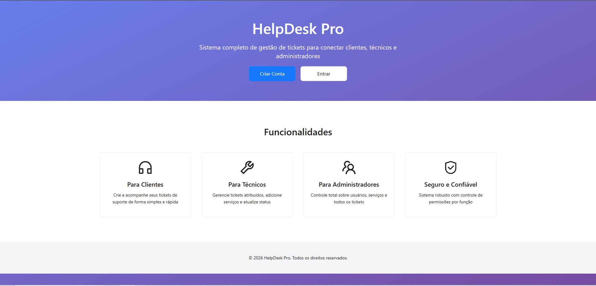

<h1 align="center">
  <br>
  HelpDesk Pro
</h1>

<p align="center">
  <a href="https://opensource.org/licenses/MIT">
    
  </a>
</p>
</h1>


---

## Features

### Client Portal
- Create new helpdesk tickets by choosing a technician and selecting services.
- Track ticket history with costs, timestamps, and live status tags.
- Inspect assigned technicians through quick modals with availability and contact info.

### Technician Workspace
- Review assigned tickets, view client details, and see the service breakdown at a glance.
- Append new billable services, adjust ticket statuses, and keep clients informed.
- Access reusable modals for managing workloads without leaving the dashboard.

### Admin Console
- Manage technicians (CRUD operations, availability windows, password resets) and clients (profile updates, account removal).
- Create, update, or deactivate catalog services and oversee every ticket in progress.
- Inspect any user via rich info modals and keep the system aligned across roles.

### Shared Experience
- Centralized authentication with cookie-based sessions and automatic logout on token failure.
- Profile management and sign-out actions accessible from every dashboard header.
- Responsive layout with Ant Design components and Tailwind-inspired utility classes.

## Tech Stack
- **React 18 + TypeScript** via Vite for a fast DX.
- **Ant Design** for component styling, icons, and form handling.
- **TanStack Query** for caching and synchronizing API data.
- **React Router** for multi-page routing between landing, auth, and dashboards.
- **Zod** for schema validation, including strict environment validation in `src/env.ts`.
- **JS Cookie** to persist authentication tokens securely.

## Getting Started
1. **Prerequisites**
   - Node.js 18+ and npm (the repo ships with `package-lock.json`).
   - A running HelpDesk API exposing endpoints for tickets, services, and users.

2. **Clone & Install**
   ```bash
   npm install
   ```

3. **Configure Environment**
   - Create `.env` (or `.env.local`) at the project root with at least:
     ```bash
     VITE_API_URL=https://your-helpdesk-api.example.com
     ```
   - `src/env.ts` validates this value at build/runtime, so make sure it is a valid URL.

4. **Run the App**
   ```bash
   npm run dev
   ```
   Visit `http://localhost:5173` (default Vite dev server) to explore the landing page and dashboards.

5. **Build for Production**
   ```bash
   npm run build
   ```
   The optimized output lives under `dist/` for deployment behind your favorite static host.

## Environment & Authentication
- The application expects the backend to issue JWT-like tokens stored in an `access_token` cookie (see `src/http/use-login.ts`).
- `AuthProvider` in `src/app/context/UserContext.tsx` fetches the current user via `useMe`, removes cookies on errors, and exposes `logout()` to every component.
- Tailored hooks in `src/http` (e.g., `use-create-ticket`, `use-update-ticket-status`) automatically attach the token when calling `${env.VITE_API_URL}`.

## Available Scripts
- `npm run dev` – start Vite in development mode with hot module reload.
- `npm run build` – generate an optimized production bundle.

## Contributing
Pull requests are welcome! Please align with the existing coding style (TypeScript + React), keep forms and API mutations within the established hook patterns, and consider adding tests or storybook entries for new components.

## 📄 License

[MIT License](https://opensource.org/licenses/MIT)
